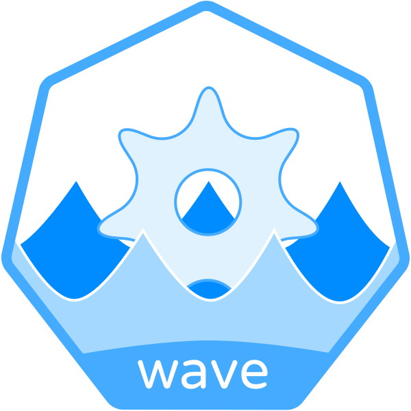

[](https://raw.githubusercontent.com/wave-k8s/wave/master/LICENSE) [](https://goreportcard.com/report/github.com/wave-k8s/wave) [](https://github.com/wave-k8s/wave/actions/workflows/image.yaml) [](https://pkg.go.dev/github.com/wave-k8s/wave)



# Wave

Wave watches Deployments within a Kubernetes cluster and ensures that each
Deployment's Pods always have up to date configuration.

By monitoring ConfigMaps and Secrets mounted by a Deployment, Wave can trigger
a Rolling Update of the Deployment when the mounted configuration is changed.

## Table of Contents

- [Introduction](#introduction)
- [Installation](#installation)
  - [Deploying to Kubernetes](#deploying-to-kubernetes)
  - [Configuration](#configuration)
    - [Leader Election](#leader-election)
    - [Sync period](#sync-period)
- [Quick Start](#quick-start)
- [Project Concepts](#project-concepts)
  - [Enabling Wave for a Deployment](#enabling-wave-for-a-deployment)
  - [Triggering Updates](#triggering-updates)
  - [Finalizers](#finalizers)
- [Communication](#communication)
- [Contributing](#contributing)
- [License](#license)

## Introduction

Not all software is built equal. Some applications can automatically reload their
configuration and continue running with the updated configuration, while others
will just continue running the old configuration until their process dies.
Wave is here to help those applications that do not support dynamic configuration
reloading.

When deploying applications to Kubernetes, it is common practice to deploy
configuration using ConfigMaps and Secrets, mounted into the Pod either as
environment variables or in files.

When this configuration is updated, if the software consuming the configuration
is not able to dynamically reload, it will continue running the old
configuration until the Pod is killed, this leads to inconsistency between the
supposed desired state of the application and the running state of the
application.

Wave monitors Deployments and their underlying configuration and will trigger
the Kubernetes Deployment controller to update the application and bring up
new Pods whenever the underlying configuration is changed.

This means that, with Wave, whenever a ConfigMap or Secret is updated, all
Deployments mounting the configuration will bring up new Pods on the cluster and
remove the old Pods with the out-of-date configuration.

Wave gives application developers confidence that the deployed configuration,
matches the live configuration.
It allows developers to discover misconfiguration as it is deployed,
rather than when the Pods happen to be re-cycled.

## Installation

Wave is released periodically. The latest version is `v0.5.0`

A list of changes can be seen in the [CHANGELOG](CHANGELOG.md).

### Deploying to Kubernetes

Public docker images for releases since v0.4.0 are available on [Quay](https://quay.io/repository/wave-k8s/wave).

#### Deploying with Helm

Helm charts are available in this repository and hosted through Github Pages.
To deploy, add the repository to helm and install:

```
$ helm repo add wave-k8s https://wave-k8s.github.io/wave/
$ helm install wave-k8s/wave
```

#### Deploying with Kustomize

Wave is a [Kubebuilder](https://github.com/kubernetes-sigs/kubebuilder) based
project, as such we have auto-generated [Kustomize](https://github.com/kubernetes-sigs/kustomize)
configuration as an example of how to install the controller in the
[config](config) folder.

```
quay.io/wave-k8s/wave
```

#### RBAC

If you are using [RBAC](https://kubernetes.io/docs/reference/access-authn-authz/rbac/)
within your cluster, you must grant the service account used by your Wave
instance permission to read all Secrets, ConfigMaps and Deployments and
the ability to update Deployments within each namespace in the cluster.

Example `ClusterRole` and `ClusterRoleBindings` are available in the
[config/rbac](config/rbac) folder.

### Configuration

The following section details the various configuration options that Wave
provides at the controller level.

#### Leader Election

Wave can be run in an active-standby HA configuration using Kubernetes leader
election.
When leader election is enabled, each Pod will attempt to become leader and,
whichever is successful, will become the active or master controller.
The master will perform all of the reconciliation of Resources.

The standby Pods will sit and wait until the leader goes away and then one
standby will be promoted to master.

To enable leader election, set the following flags:

```
--leader-election=true
--leader-election-id=<name-of-leader-election-configmap>
--leader-election-namespace=<namespace-controller-runs-in>
```

#### Sync period

The controller uses Kubernetes informers to cache resources and reduce load on
the Kubernetes API server. Every informer has a sync period, after which it will
refresh all resources within its cache. At this point, every item in the cache
is queued for reconciliation by the controller.

Therefore, by setting the following flag;

```
--sync-period=5m // Default value of 5m (5 minutes)
```

You can ensure that every resource will be reconciled at least every 5 minutes.

## Quick Start

If you haven't yet got Wave running on your cluster, see
[Installation](#installation) for details on how to get it running.

Wave watches all Deployments within a cluster but only processes those that have
the annotation `wave.pusher.com/update-on-config-change: "true"` which allows
individual service owners to opt-in to the Wave controller.

Therefore, to enable Wave for your Deployment, add the
`wave.pusher.com/update-on-config-change` annotation to your Deployment as shown
below:

```
apiVersion: apps/v1
kind: Deployment
metadata:
  annotations:
    wave.pusher.com/update-on-config-change: "true"
...
```

Once enabled, Wave will set the initial configuration hash as an annotation on
the Deployment's `PodTemplate`. You will be able to see this when reading
your Deployment:

```
$ kubectl get deployment foo
apiVersion: apps/v1
kind: Deployment
metadata:
  name: foo
  namespace: default
  annotations:
    wave.pusher.com/update-on-config-change: "true"
spec:
  template:
    metadata:
      annotations:
        wave.pusher.com/config-hash: "<SHA256_HASH>"
...
```

From now on, when a mounted ConfigMap or Secret is updated, Wave will update
this `config-hash` annotation and cause a Rolling Update to occur.

## Project Concepts

This section outlines some of the underlying concepts that enable this
controller to work the way it does.

### Enabling Wave for a Deployment

Wave acts as an opt-in controller on a per Deployment basis.
Before processing any Deployment, Wave checks for the presence of a "Required
annotation". If the annotation is not present, Wave will ignore the Deployment.

Therefore, to enable Wave for your Deployment, add the
`wave.pusher.com/update-on-config-change` annotation to your Deployment as shown
below:

```
apiVersion: apps/v1
kind: Deployment
metadata:
  annotations:
    wave.pusher.com/update-on-config-change: "true"
...
```

Wave will now start processing this Deployment.

### Triggering Updates

Wave monitors the data stored in ConfigMaps and Secrets referenced within
a Deployment.
By calculating a SHA256 hash of the data in a reproducible manner,
Wave can determine when the data with the ConfigMaps and Secrets has changed.

Wave stores the calculated hash as an annotation on the `PodTemplate` within the
Deployment's specification and will update the Deployment whenever the hash is
changed.

Modifying the `PodTemplate` in this way causes the Kubernetes Deployment
controller to start a Rolling Update of the Deployment's Pods without changing
any of the configuration of the containers or other controllers operation on the
Pods and Deployment.

### Finalizers

Wave adds an `OwnerReference` to all ConfigMaps and Secrets that are referenced
by a Deployment. This allows Wave to trigger a reconciliation whenever the
ConfigMaps or Secrets are modified.

Normally, when an owner is deleted, the Kubernetes Garbage Collector deletes all
child resources. This is not desirable and so Wave prevents this from happening.

Wave managed Deployments will have a `wave.pusher.com/finalizer` Finalizer
added to them. This allows Wave to perform advanced clean-up operation when a
Deployment is deleted.

When Wave encounters a Deployment marked for deletion that has the Wave
Finalizer, it checks for all ConfigMaps and Secrets with an OwnerReference
pointing to the Deployment and removes the OwnerReference. Thus preventing the
ConfigMaps and Secrets from being deleted by the Garbage Collector.

Read the docs for more about
[Kubernetes Garbage Collection](https://kubernetes.io/docs/concepts/workloads/controllers/garbage-collection/).

## Communication

- Found a bug? Please open an issue.
- Have a feature request. Please open an issue.
- If you want to contribute, please submit a pull request

## Contributing

Please see our [Contributing](CONTRIBUTING.md) guidelines.

## License

This project is licensed under Apache 2.0 and a copy of the license is available [here](LICENSE).
